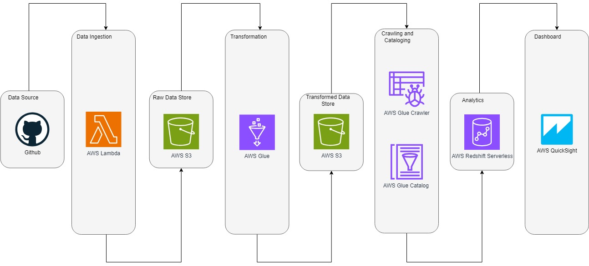

# Olympics_Data_Analytics
## Steps

#### AWS LAMBDA:
###### General configuration
        - Timeout -> 5 min 0 sec
        - Memory -> 128 MB
        - SnapStart -> None
        - Ephemeral storage -> 512 MB

###### Runtime settings  
        - Runtime -> Python 3.10
        - Handler -> lambda_function.lambda_handler
        - Architecture -> x86_64

###### Enviroment variables
        - key -> CSV_URL_PATH 
        - value -> https://raw.githubusercontent.com/YOUR_GITHUB/main/data/
        - key -> S3_BUCKET
        - value -> YOUR RAW ZONE BUCKET

###### Code
        - code -> lambda_function.py

###### Layers
        - name -> Olympic_Data_Analytics_Layer
        - layer -> requests-lib.zip
        - Layer version -> 2
        - Compatible runtimes -> python3.10
        - Compatible architectures -> x86_64

#### AWS S3:
###### General S3 Raw Data
        - bucket -> YOUR RAW ZONE BUCKET
        - objetct -> olympic-data-analytics/

###### General S3 Stage Data
        - bucket -> YOUR RAW ZONE BUCKET
        - objetct -> olympic-data-analytics/

#### AWS GLUE:
###### Basic properties
        - Etl job name -> Olympic_Data_Analytics_Glue_Job
        - IAM Role -> YOUR IAM ROLE
        - Type -> Spark
        - Glue version -> Glue 4.0 - Supports spark 3.3, Scala 2, Python 3
        - Language -> Python 3
        - Worker type -> G 1X
        
###### Advanced properties
        - Script path -> YOUR SCRIPT PATH BUCKET
        - Spark UI logs path -> YOUR LOG PATH BUCKET

###### ETL Visual
        Data Source Properties - S3

        - Name -> Athletes Source
        - S3 source type ->  S3 location
        - S3 URL -> s3://YOUR RAW ZONE BUCKET/olympic-data-analytics/Athletes.csv
        - Data format -> CSV
        - Delimiter -> Semicolon (;)
        - Quote character -> Double quote (")
        - First line of source file contains column headers

        - Name -> Teams Source
        - S3 source type ->  S3 location
        - S3 URL -> s3://YOUR RAW ZONE BUCKET/olympic-data-analytics/Teams.csv
        - Data format -> CSV
        - Delimiter -> Semicolon (;)
        - Quote character -> Double quote (")
        - First line of source file contains column headers

        - Name -> Medals Source
        - S3 source type ->  S3 location
        - S3 URL -> s3://YOUR RAW ZONE BUCKET/olympic-data-analytics/Medals.csv
        - Data format -> CSV
        - Delimiter -> Semicolon (;)
        - Quote character -> Double quote (")
        - First line of source file contains column headers

        - Name -> Entriesgender Source
        - S3 source type ->  S3 location
        - S3 URL -> s3://YOUR RAW ZONE BUCKET/olympic-data-analytics/EntriesGender.csv
        - Data format -> CSV
        - Delimiter -> Semicolon (;)
        - Quote character -> Double quote (")
        - First line of source file contains column headers

        - Name -> Coaches Source
        - S3 source type ->  S3 location
        - S3 URL -> s3://YOUR RAW ZONE BUCKET/olympic-data-analytics/Coaches.csv
        - Data format -> CSV
        - Delimiter -> Semicolon (;)
        - Quote character -> Double quote (")
        - First line of source file contains column headers

        Transform

        - Name -> Change Schema Athletes
        - Node parents -> Athletes Source
        - Change Schema (Apply mapping)
        	- 	Source Key	Target Key	Data type
        		name 		PersonName	string
        		noc		Country		string
        		discipline	discipline	string

        - Name -> Change Schema Teams
        - Node parents -> Teams Source
        - Change Schema (Apply mapping)
        	-	Source Key	Target Key	Data type
        		name		TeamName	string
        		discipline	discipline	string
        		noc		Country		string
        		event		event		string

        - Name -> Change Schema Medals
        - Node parents -> Medals Source
        - Change Schema (Apply mapping)
        	-	Source Key	Target Key	Data type
        		rank		rank		string
        		team/noc	Team_Country	string
        		gold		gold		string
        		silver		silver		string
        		bronze		bronze		string
        		total		total		string
        		rank by total	rank_by_total	string

        - Name -> Change Schema Entriesgender
        - Node parents -> Entriesgender Source
        - Change Schema (Apply mapping)
        	-	Source Key	Target Key	Data type
        		discipline	discipline	string
        		female		female		string
        		male		male		string
        		total		total		string

        - Name -> Change Schema Coaches
        - Node parents -> Coaches Source
        - Change Schema (Apply mapping)
        	-	Source Key	Target Key	Data type
        		name		name		string
        		noc		Country		string
        		discipline	discipline	string
        		event		event		string

        Data target properties - S3

        - Name -> Athletes Destination
        - Node parents -> Change Schema Athletes
        - Format -> Parquet
        - Compression Type -> Snappy
        - S3 Target Location -> s3://YOUR STAGE ZONE BUCKET/olympic-data-analytics/Athletes/
        - Do not update the Data Catalog

        - Name -> Teams Destination
        - Node parents -> Change Schema Teams
        - Format -> Parquet
        - Compression Type -> Snappy
        - S3 Target Location -> s3://YOUR STAGE ZONE BUCKET/olympic-data-analytics/Teams/
        - Do not update the Data Catalog

        - Name -> Medals Destination
        - Node parents -> Change Schema Medals
        - Format -> Parquet
        - Compression Type -> Snappy
        - S3 Target Location -> s3://YOUR STAGE ZONE BUCKET/olympic-data-analytics/Medals/
        - Do not update the Data Catalog

        - Name -> Entriesgender Destination
        - Node parents -> Change Schema Entriesgender
        - Format -> Parquet
        - Compression Type -> Snappy
        - S3 Target Location -> s3://YOUR STAGE ZONE BUCKET/olympic-data-analytics/Entriesgender/
        - Do not update the Data Catalog

        - Name -> Coaches Destination
        - Node parents -> Change Schema Coaches
        - Format -> Parquet
        - Compression Type -> Snappy
        - S3 Target Location -> s3://YOUR STAGE ZONE BUCKET/olympic-data-analytics/Coaches/
        - Do not update the Data Catalog

#### AWS GLUE CRAWLER:
        Crawler properties

        - Name -> Athletes
        - IAM role -> YOUR IAM ROLE
        - Database -> olympic-data-analytics-db
        - State -> READY
        - Table prefix -> tbl-
        - Data source -> s3://YOUR RAW ZONE BUCKET/olympic-data-analytics/Athletes

        - Name -> Coaches
        - IAM role -> YOUR IAM ROLE
        - Database -> olympic-data-analytics-db
        - State -> READY
        - Table prefix -> tbl-
        - Data source -> s3://YOUR RAW ZONE BUCKET/olympic-data-analytics/Coaches

        - Name -> Entriesgender
        - IAM role -> YOUR IAM ROLE
        - Database -> olympic-data-analytics-db
        - State -> READY
        - Table prefix -> tbl-
        - Data source -> s3://YOUR RAW ZONE BUCKET/olympic-data-analytics/Entriesgender

        - Name -> Medals
        - IAM role -> YOUR IAM ROLE
        - Database -> olympic-data-analytics-db
        - State -> READY
        - Table prefix -> tbl-
        - Data source -> s3://YOUR RAW ZONE BUCKET/olympic-data-analytics/Medals

        - Name -> Teams
        - IAM role -> YOUR IAM ROLE
        - Database -> olympic-data-analytics-db
        - State -> READY
        - Table prefix -> tbl-
        - Data source -> s3://YOUR RAW ZONE BUCKET/olympic-data-analytics/Teams

#### AWS GLUE CATALOG:
        Databases
        
	    - Name -> olympic-data-analytics-db
	    - Description -> olympic-data-analytics-db

## Architecture-Diagram
