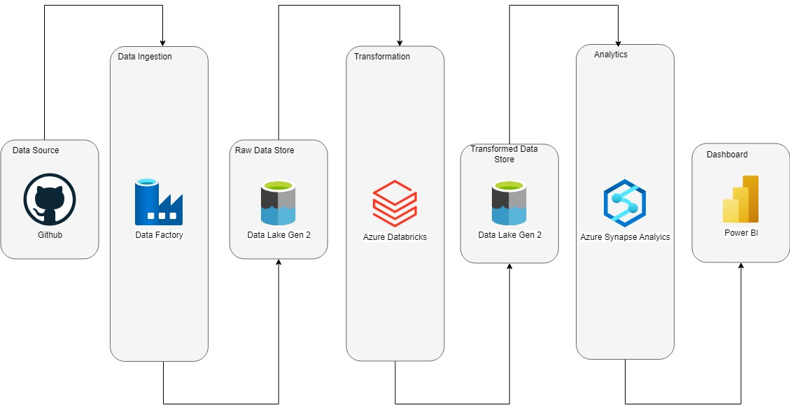

# Olympics_Data_Analytics
## Steps

#### AZURE FACTORY:
###### General configuration
        - Data Factory Name v2 -> data-engineering-data-fact
        - group resources -> data-engineering
        - subscription -> YOUR SUBSCRIPTION
        - Pipelines -> Olympic_Data_Analytics_Factory

###### Copy data Athletes
        - Name -> Athletes
        - Source 
                - Source dataset -> Athletes_Source
                        - Connection:
                        	- Linked service:
                        		- Name -> Athletes_HTTP
                        		- Description -> Athletes_HTTP
                        		- Connect via integration runtime -> AutoResolverIntegrationRuntime
                        		- Base URL -> https://raw.githubusercontent.com/YOUR_GITHUB/main/data/Athletes.csv
                        		- Server certification validation -> Disable
                        		- Authentication type -> Anonymous

                        	- Column type -> Semicolon 
                        	- Row delimiter -> Default (\r\n, or \r\n)
                        	- Encoding -> Default(UTF-8)
                        	- Quote character -> Double quote (")
                        	- Escape character -> Backslash (\)
                        	- First row as header -> Check	
                - Request method -> GET
        - Sink
                - Sink dataset -> Athletes_Destination
                        - Connection:
                                - Linked service:
                                        - Name -> BS_Athletes
                                        - Description -> BS_Athletes
                                        - Connect via integration runtime -> AutoResolverIntegrationRuntime
                                        - Authentication type -> Account key
                                        - Storage account name -> YOUR DATA STAGE BUCKET
                                        - Storage account key -> YOUR DATA STAGE BUCKET KEY
                                        - Endpoint suffix -> core.windows.net
                                        - Test linked service -> check
                                - File path -> YOUR DATA STAGE BUCKET / Directory / Athletes.csv
                                - Column delimiter -> Comma (,)
                                - Row delimiter -> Default (\r\n, or \r\n)
                                - Encoding -> Default(UTF-8)
                        	- Quote character -> Double quote (")
                        	- Escape character -> Backslash (\)
                        	- First row as header -> Check	

###### Copy data Coaches
        - Name -> Coaches
        - Source 
                - Source dataset -> Coaches_Source
                        - Connection:
                        	- Linked service:
                        		- Name -> Coaches_HTTP
                        		- Description -> Coaches_HTTP
                        		- Connect via integration runtime -> AutoResolverIntegrationRuntime
                        		- Base URL -> https://raw.githubusercontent.com/YOUR_GITHUB/main/data/Coaches.csv
                        		- Server certification validation -> Disable
                        		- Authentication type -> Anonymous

                        	- Column type -> Semicolon 
                        	- Row delimiter -> Default (\r\n, or \r\n)
                        	- Encoding -> Default(UTF-8)
                        	- Quote character -> Double quote (")
                        	- Escape character -> Backslash (\)
                        	- First row as header -> Check	
                - Request method -> GET
        - Sink
                - Sink dataset -> Coaches_Destination
                        - Connection:
                                - Linked service:
                                        - Name -> BS_Coaches
                                        - Description -> BS_Coaches
                                        - Connect via integration runtime -> AutoResolverIntegrationRuntime
                                        - Authentication type -> Account key
                                        - Storage account name -> YOUR DATA STAGE BUCKET
                                        - Storage account key -> YOUR DATA STAGE BUCKET KEY
                                        - Endpoint suffix -> core.windows.net
                                        - Test linked service -> check
                                - File path -> YOUR DATA STAGE BUCKET / Directory / Coaches.csv
                                - Column delimiter -> Comma (,)
                                - Row delimiter -> Default (\r\n, or \r\n)
                                - Encoding -> Default(UTF-8)
                        	- Quote character -> Double quote (")
                        	- Escape character -> Backslash (\)
                        	- First row as header -> Check

###### Copy data EntriesGender
        - Name -> EntriesGender
        - Source 
                - Source dataset -> EntriesGender_Source
                        - Connection:
                        	- Linked service:
                        		- Name -> EntriesGender_HTTP
                        		- Description -> EntriesGender_HTTP
                        		- Connect via integration runtime -> AutoResolverIntegrationRuntime
                        		- Base URL -> https://raw.githubusercontent.com/YOUR_GITHUB/main/data/EntriesGender.csv
                        		- Server certification validation -> Disable
                        		- Authentication type -> Anonymous

                        	- Column type -> Semicolon 
                        	- Row delimiter -> Default (\r\n, or \r\n)
                        	- Encoding -> Default(UTF-8)
                        	- Quote character -> Double quote (")
                        	- Escape character -> Backslash (\)
                        	- First row as header -> Check	
                - Request method -> GET
        - Sink
                - Sink dataset -> EntriesGender_Destination
                        - Connection:
                                - Linked service:
                                        - Name -> BS_EntriesGender
                                        - Description -> BS_EntriesGender
                                        - Connect via integration runtime -> AutoResolverIntegrationRuntime
                                        - Authentication type -> Account key
                                        - Storage account name -> YOUR DATA STAGE BUCKET
                                        - Storage account key -> YOUR DATA STAGE BUCKET KEY
                                        - Endpoint suffix -> core.windows.net
                                        - Test linked service -> check
                                - File path -> YOUR DATA STAGE BUCKET / Directory / EntriesGender.csv
                                - Column delimiter -> Comma (,)
                                - Row delimiter -> Default (\r\n, or \r\n)
                                - Encoding -> Default(UTF-8)
                        	- Quote character -> Double quote (")
                        	- Escape character -> Backslash (\)
                        	- First row as header -> Check

###### Copy data Medals
        - Name -> Medals
        - Source 
                - Source dataset -> Medals_Source
                        - Connection:
                        	- Linked service:
                        		- Name -> Medals_HTTP
                        		- Description -> Medals_HTTP
                        		- Connect via integration runtime -> AutoResolverIntegrationRuntime
                        		- Base URL -> https://raw.githubusercontent.com/YOUR_GITHUB/main/data/Medals.csv
                        		- Server certification validation -> Disable
                        		- Authentication type -> Anonymous

                        	- Column type -> Semicolon 
                        	- Row delimiter -> Default (\r\n, or \r\n)
                        	- Encoding -> Default(UTF-8)
                        	- Quote character -> Double quote (")
                        	- Escape character -> Backslash (\)
                        	- First row as header -> Check	
                - Request method -> GET
        - Sink
                - Sink dataset -> Medals_Destination
                        - Connection:
                                - Linked service:
                                        - Name -> BS_Medals
                                        - Description -> BS_Medals
                                        - Connect via integration runtime -> AutoResolverIntegrationRuntime
                                        - Authentication type -> Account key
                                        - Storage account name -> YOUR DATA STAGE BUCKET
                                        - Storage account key -> YOUR DATA STAGE BUCKET KEY
                                        - Endpoint suffix -> core.windows.net
                                        - Test linked service -> check
                                - File path -> YOUR DATA STAGE BUCKET / Directory / Medals.csv
                                - Column delimiter -> Comma (,)
                                - Row delimiter -> Default (\r\n, or \r\n)
                                - Encoding -> Default(UTF-8)
                        	- Quote character -> Double quote (")
                        	- Escape character -> Backslash (\)
                        	- First row as header -> Check

###### Copy data Teams
        - Name -> Teams
        - Source 
                - Source dataset -> Teams_Source
                        - Connection:
                        	- Linked service:
                        		- Name -> Teams_HTTP
                        		- Description -> Teams_HTTP
                        		- Connect via integration runtime -> AutoResolverIntegrationRuntime
                        		- Base URL -> https://raw.githubusercontent.com/YOUR_GITHUB/main/data/Teams.csv
                        		- Server certification validation -> Disable
                        		- Authentication type -> Anonymous

                        	- Column type -> Semicolon 
                        	- Row delimiter -> Default (\r\n, or \r\n)
                        	- Encoding -> Default(UTF-8)
                        	- Quote character -> Double quote (")
                        	- Escape character -> Backslash (\)
                        	- First row as header -> Check	
                - Request method -> GET
        - Sink
                - Sink dataset -> Teams_Destination
                        - Connection:
                                - Linked service:
                                        - Name -> Teams_Medals
                                        - Description -> Teams_Medals
                                        - Connect via integration runtime -> AutoResolverIntegrationRuntime
                                        - Authentication type -> Account key
                                        - Storage account name -> YOUR DATA STAGE BUCKET
                                        - Storage account key -> YOUR DATA STAGE BUCKET KEY
                                        - Endpoint suffix -> core.windows.net
                                        - Test linked service -> check
                                - File path -> YOUR DATA STAGE BUCKET / Directory / Teams.csv
                                - Column delimiter -> Comma (,)
                                - Row delimiter -> Default (\r\n, or \r\n)
                                - Encoding -> Default(UTF-8)
                        	- Quote character -> Double quote (")
                        	- Escape character -> Backslash (\)
                        	- First row as header -> Check

## Architecture-Diagram
